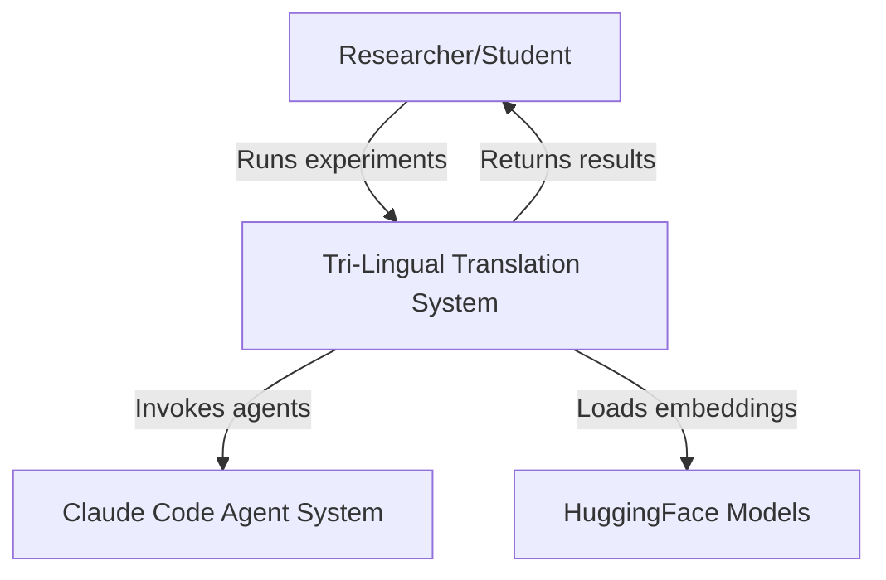
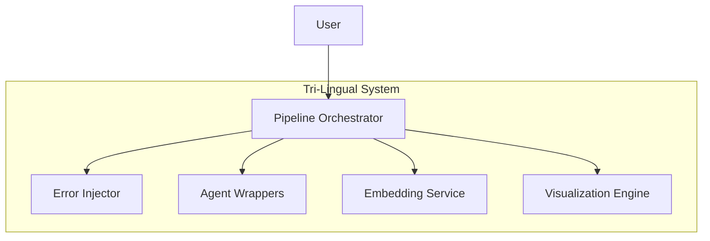
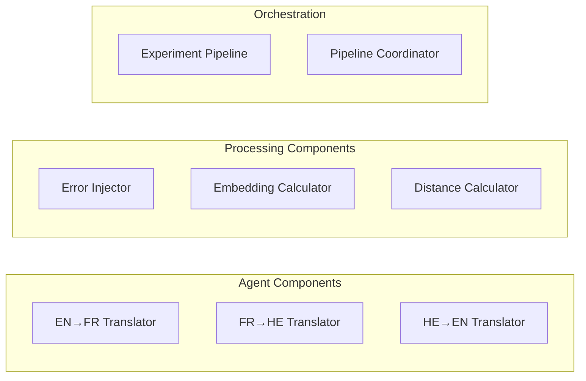
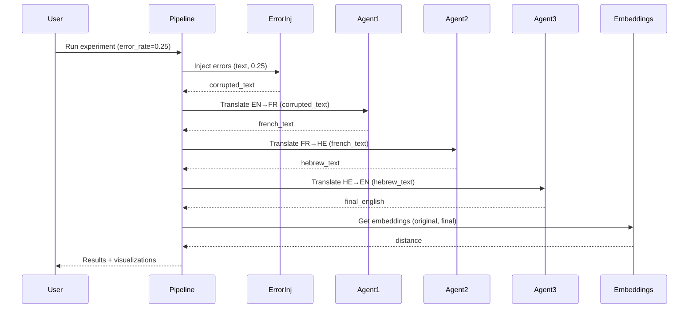

# Compliance Action Plan for Tri-Lingual Turing Agents Project

**Document Version:** 1.0
**Date:** November 28, 2025
**Based on:** Software Submission Guidelines v1.0 + v2.0 (22-11-2025)

---

## Executive Summary

This document provides a comprehensive action plan to bring the tri-lingual-turing-agents project into full compliance with M.Sc. Computer Science software submission guidelines. The plan addresses requirements from both guideline documents, with special focus on the three new chapters added in version 2.0:

- **Chapter 13:** Project Organization as Python Package
- **Chapter 14:** Parallel Processing and Performance
- **Chapter 15:** Modular Design and Building Blocks

**Estimated Time to Complete:** 3-4 weeks
**Priority Levels:** Critical (must have) → Required (should have) → Recommended (nice to have)

---

## Table of Contents

1. [Critical Priority Items](#critical-priority-items)
2. [Required Priority Items](#required-priority-items)
3. [Recommended Priority Items](#recommended-priority-items)
4. [Detailed Implementation Steps](#detailed-implementation-steps)
5. [Technical Checklists](#technical-checklists)
6. [Timeline and Milestones](#timeline-and-milestones)

---

## CRITICAL PRIORITY ITEMS

### 1. Package Organization (Chapter 13 - NEW in v2.0)

**Status:** ❌ Not Implemented
**Priority:** CRITICAL
**Time Estimate:** 2-3 days
**Guideline Reference:** Version 2.0, Chapter 15 (pages 17-18)

#### What's Missing:
- No `setup.py` or `pyproject.toml` package definition file
- Missing `__init__.py` files in directories
- Using absolute imports instead of relative imports
- Not organized as installable Python package
- Package cannot be installed with `pip install -e .`

#### Action Items:

**1.1 Create Package Definition File**
```bash
# Choose ONE of the following:
# Option A: Create pyproject.toml (modern approach - RECOMMENDED)
# Option B: Create setup.py (traditional approach)
```

**Option A: pyproject.toml** (Recommended)
```toml
[build-system]
requires = ["setuptools>=45", "wheel"]
build-backend = "setuptools.build_meta"

[project]
name = "tri-lingual-agents"
version = "1.0.0"
description = "Multi-agent translation system exploring semantic drift through round-trip translation"
readme = "README.md"
authors = [
    {name = "Tal Barda", email = "your.email@example.com"}
]
license = {text = "Educational Use Only"}
requires-python = ">=3.8"
dependencies = [
    "anthropic>=0.3.0",
    "openai>=1.0.0",
    "sentence-transformers>=2.2.0",
    "torch>=2.0.0",
    "numpy>=1.24.0",
    "matplotlib>=3.7.0",
    "python-dotenv>=1.0.0",
    "rich>=13.0.0",
]

[project.optional-dependencies]
dev = [
    "pytest>=7.4.0",
    "pytest-cov>=4.1.0",
    "black>=23.0.0",
    "flake8>=6.0.0",
]

[project.urls]
Homepage = "https://github.com/TalBarda8/tri-lingual-turing-agents"
Documentation = "https://github.com/TalBarda8/tri-lingual-turing-agents#readme"

[tool.setuptools.packages.find]
where = ["src"]
```

**1.2 Restructure Directory Layout**

**Current Structure:**
```
tri-lingual-turing-agents/
├── src/
│   ├── agents.py
│   ├── embeddings.py
│   ├── error_injection.py
│   ├── pipeline.py
│   ├── visualization.py
│   └── main.py
├── tests/
├── results/
└── ...
```

**Required Structure:**
```
tri-lingual-turing-agents/
├── src/
│   └── tri_lingual_agents/          # Package directory
│       ├── __init__.py               # Package init - MUST ADD
│       ├── agents/                   # Subpackage - REORGANIZE
│       │   ├── __init__.py          # MUST ADD
│       │   ├── base.py              # Base agent classes
│       │   └── translators.py       # Translation agent wrappers
│       ├── embeddings/              # Subpackage - REORGANIZE
│       │   ├── __init__.py          # MUST ADD
│       │   └── distance.py          # Distance calculations
│       ├── error_injection/         # Subpackage - REORGANIZE
│       │   ├── __init__.py          # MUST ADD
│       │   └── injector.py          # Error injection logic
│       ├── pipeline/                # Subpackage - REORGANIZE
│       │   ├── __init__.py          # MUST ADD
│       │   └── orchestrator.py      # Pipeline orchestration
│       └── visualization/           # Subpackage - REORGANIZE
│           ├── __init__.py          # MUST ADD
│           └── plots.py             # Visualization functions
├── tests/
│   ├── __init__.py                  # MUST ADD
│   ├── test_agents/
│   │   ├── __init__.py              # MUST ADD
│   │   └── test_translators.py
│   ├── test_embeddings/
│   │   ├── __init__.py              # MUST ADD
│   │   └── test_distance.py
│   └── ...
├── docs/                            # Additional documentation
├── pyproject.toml                   # MUST ADD
├── setup.py (optional)
├── requirements.txt
└── README.md
```

**1.3 Add __init__.py Files**

**src/tri_lingual_agents/__init__.py:**
```python
"""
Tri-Lingual Turing Agents Package

A multi-agent translation system that explores semantic drift through
round-trip translation pipeline (English → French → Hebrew → English).
"""

__version__ = "1.0.0"
__author__ = "Tal Barda"
__all__ = [
    "agents",
    "embeddings",
    "error_injection",
    "pipeline",
    "visualization",
]

# Export key components for easy access
from .agents import EnglishFrenchTranslator, FrenchHebrewTranslator, HebrewEnglishTranslator
from .embeddings import calculate_cosine_distance, get_embedding
from .error_injection import inject_spelling_errors
from .pipeline import ExperimentPipeline
from .visualization import plot_error_rate_vs_distance
```

**Each subpackage __init__.py:**
```python
# src/tri_lingual_agents/agents/__init__.py
"""Agent modules for translation pipeline."""

from .base import BaseAgent
from .translators import (
    EnglishFrenchTranslator,
    FrenchHebrewTranslator,
    HebrewEnglishTranslator,
)

__all__ = [
    "BaseAgent",
    "EnglishFrenchTranslator",
    "FrenchHebrewTranslator",
    "HebrewEnglishTranslator",
]
```

**1.4 Convert to Relative Imports**

**WRONG (Absolute Imports):**
```python
# ❌ DON'T DO THIS
from src.agents import EnglishFrenchTranslator
from src.embeddings import calculate_cosine_distance
import src.error_injection
```

**CORRECT (Relative Imports):**
```python
# ✅ DO THIS
from .agents import EnglishFrenchTranslator
from .embeddings import calculate_cosine_distance
from . import error_injection

# Or from parent package:
from ..embeddings import calculate_cosine_distance
```

**Search and Replace Pattern:**
```bash
# Find all instances of absolute imports
grep -r "from src\." src/
grep -r "import src\." src/

# Replace with relative imports
# Example: from src.agents → from .agents
# Example: from src.embeddings.distance → from .embeddings.distance
```

**1.5 Test Package Installation**

```bash
# Install in development mode
pip install -e .

# Test imports work
python -c "from tri_lingual_agents import ExperimentPipeline; print('Success!')"

# Verify package metadata
pip show tri-lingual-agents
```

---

### 2. Parallel Processing Implementation (Chapter 14 - NEW in v2.0)

**Status:** ❌ Not Implemented
**Priority:** CRITICAL
**Time Estimate:** 3-4 days
**Guideline Reference:** Version 2.0, Chapter 16 (pages 19-20)

#### What's Missing:
- No multiprocessing for CPU-bound operations (embeddings, batch processing)
- No multithreading for I/O-bound operations (API calls, file I/O)
- No thread safety mechanisms (locks, semaphores)
- No performance optimization or benchmarking
- No dynamic process/thread count based on `multiprocessing.cpu_count()`

#### Understanding the Difference:

| Type | Use Case | Python Module | Our Project Examples |
|------|----------|---------------|---------------------|
| **Multiprocessing** | CPU-bound tasks | `multiprocessing` | Embedding calculations, error injection at scale, batch semantic distance computation |
| **Multithreading** | I/O-bound tasks | `threading` | Agent API calls, file I/O, waiting for network responses |

#### Action Items:

**2.1 Identify CPU-Bound Operations**

Current CPU-intensive operations in our project:
1. **Embedding Generation** - `get_embedding()` in `src/embeddings.py`
2. **Semantic Distance Calculation** - `calculate_cosine_distance()`
3. **Batch Error Injection** - Processing multiple experiments with error injection
4. **Data Processing** - Large-scale text transformations

**2.2 Implement Multiprocessing for Embeddings**

Create new file: `src/tri_lingual_agents/embeddings/parallel.py`

```python
"""Parallel processing for embedding calculations."""

import multiprocessing as mp
from typing import List
from functools import partial

from .distance import get_embedding, calculate_cosine_distance


class ParallelEmbeddingProcessor:
    """
    Building Block for parallel embedding processing.

    Input Data:
    - texts: List[str] - list of texts to embed

    Output Data:
    - embeddings: List[np.ndarray] - list of embedding vectors

    Setup Data:
    - n_processes: int - number of parallel processes (default: CPU count)
    - model_name: str - embedding model name
    """

    def __init__(self, model_name: str = "all-MiniLM-L6-v2", n_processes: int = None):
        """Initialize parallel embedding processor."""
        self.model_name = model_name
        self.n_processes = n_processes or mp.cpu_count()
        self._validate_config()

    def _validate_config(self):
        """Validate configuration."""
        if self.n_processes <= 0:
            raise ValueError("n_processes must be positive")
        if self.n_processes > mp.cpu_count():
            raise ValueError(f"n_processes ({self.n_processes}) exceeds CPU count ({mp.cpu_count()})")

    def process_batch(self, texts: List[str]) -> List:
        """
        Process batch of texts in parallel.

        Args:
            texts: List of texts to embed

        Returns:
            List of embedding vectors
        """
        # Input validation
        if not isinstance(texts, list):
            raise TypeError("texts must be a list")
        if not all(isinstance(t, str) for t in texts):
            raise TypeError("all texts must be strings")

        # Use multiprocessing pool
        with mp.Pool(processes=self.n_processes) as pool:
            embeddings = pool.map(
                partial(get_embedding, model_name=self.model_name),
                texts
            )

        return embeddings

    def calculate_distances_parallel(
        self,
        original_texts: List[str],
        final_texts: List[str]
    ) -> List[float]:
        """
        Calculate semantic distances in parallel.

        Args:
            original_texts: List of original texts
            final_texts: List of final texts

        Returns:
            List of cosine distances
        """
        # Validation
        if len(original_texts) != len(final_texts):
            raise ValueError("original_texts and final_texts must have same length")

        # Get embeddings in parallel
        all_texts = original_texts + final_texts
        all_embeddings = self.process_batch(all_texts)

        # Split embeddings
        n = len(original_texts)
        orig_embeddings = all_embeddings[:n]
        final_embeddings = all_embeddings[n:]

        # Calculate distances
        distances = [
            calculate_cosine_distance(orig, final)
            for orig, final in zip(orig_embeddings, final_embeddings)
        ]

        return distances
```

**2.3 Identify I/O-Bound Operations**

Current I/O-intensive operations:
1. **Agent API Calls** - Waiting for Claude Code agent responses
2. **File Reading/Writing** - Loading data, saving results
3. **Network Requests** - Any external API calls

**2.4 Implement Multithreading for Agent Calls**

Create new file: `src/tri_lingual_agents/agents/parallel.py`

```python
"""Parallel processing for agent orchestration."""

import threading
from typing import List, Dict
from queue import Queue
import time

from .translators import (
    EnglishFrenchTranslator,
    FrenchHebrewTranslator,
    HebrewEnglishTranslator,
)


class ParallelAgentOrchestrator:
    """
    Building Block for parallel agent orchestration.

    Input Data:
    - experiments: List[Dict] - list of experiment configurations

    Output Data:
    - results: List[Dict] - list of experiment results

    Setup Data:
    - max_threads: int - maximum concurrent threads
    - timeout: int - timeout per agent call in seconds
    """

    def __init__(self, max_threads: int = 3, timeout: int = 300):
        """Initialize parallel orchestrator."""
        self.max_threads = max_threads
        self.timeout = timeout
        self.results_queue = Queue()
        self.lock = threading.Lock()  # Thread safety
        self._validate_config()

    def _validate_config(self):
        """Validate configuration."""
        if self.max_threads <= 0:
            raise ValueError("max_threads must be positive")
        if self.timeout <= 0:
            raise ValueError("timeout must be positive")

    def process_experiments_parallel(
        self,
        experiments: List[Dict]
    ) -> List[Dict]:
        """
        Process multiple experiments in parallel.

        Args:
            experiments: List of experiment configurations

        Returns:
            List of completed experiments with results
        """
        # Input validation
        if not isinstance(experiments, list):
            raise TypeError("experiments must be a list")

        threads = []

        # Create threads for each experiment
        for exp in experiments:
            thread = threading.Thread(
                target=self._process_single_experiment,
                args=(exp,)
            )
            threads.append(thread)
            thread.start()

            # Limit concurrent threads
            if len(threads) >= self.max_threads:
                for t in threads:
                    t.join()
                threads = []

        # Wait for remaining threads
        for t in threads:
            t.join()

        # Collect results
        results = []
        while not self.results_queue.empty():
            results.append(self.results_queue.get())

        return results

    def _process_single_experiment(self, experiment: Dict):
        """Process a single experiment (runs in thread)."""
        try:
            # Agent calls are I/O-bound (waiting for API responses)
            agent1 = EnglishFrenchTranslator()
            agent2 = FrenchHebrewTranslator()
            agent3 = HebrewEnglishTranslator()

            # Sequential pipeline within thread
            french = agent1.translate(experiment['corrupted'])
            hebrew = agent2.translate(french)
            final_english = agent3.translate(hebrew)

            # Thread-safe result storage
            with self.lock:
                experiment['french'] = french
                experiment['hebrew'] = hebrew
                experiment['final_english'] = final_english
                experiment['status'] = 'completed'
                self.results_queue.put(experiment)

        except Exception as e:
            with self.lock:
                experiment['status'] = 'failed'
                experiment['error'] = str(e)
                self.results_queue.put(experiment)
```

**2.5 Add Thread Safety Mechanisms**

Key patterns to implement:

```python
import threading

# 1. Lock for shared resources
lock = threading.Lock()

with lock:
    # Critical section - only one thread at a time
    shared_data.append(result)

# 2. Semaphore for limiting concurrent access
semaphore = threading.Semaphore(5)  # Max 5 concurrent

with semaphore:
    # Limited concurrent access
    api_call()

# 3. Context managers for resource cleanup
with mp.Pool(processes=4) as pool:
    results = pool.map(func, data)
    # Pool automatically cleaned up
```

**2.6 Performance Testing**

Create benchmarking script: `tests/benchmark_parallel.py`

```python
"""Benchmark parallel vs sequential processing."""

import time
from tri_lingual_agents.embeddings.parallel import ParallelEmbeddingProcessor
from tri_lingual_agents.embeddings import get_embedding

def benchmark_embeddings():
    """Compare parallel vs sequential embedding generation."""
    texts = ["Sample text " + str(i) for i in range(50)]

    # Sequential
    start = time.time()
    for text in texts:
        get_embedding(text)
    sequential_time = time.time() - start

    # Parallel
    processor = ParallelEmbeddingProcessor(n_processes=4)
    start = time.time()
    processor.process_batch(texts)
    parallel_time = time.time() - start

    speedup = sequential_time / parallel_time
    print(f"Sequential: {sequential_time:.2f}s")
    print(f"Parallel: {parallel_time:.2f}s")
    print(f"Speedup: {speedup:.2f}x")

if __name__ == "__main__":
    benchmark_embeddings()
```

---

### 3. Building Block Design (Chapter 15 - NEW in v2.0)

**Status:** ⚠️ Partially Implemented
**Priority:** CRITICAL
**Time Estimate:** 3-4 days
**Guideline Reference:** Version 2.0, Chapter 17 (pages 21-25)

#### What's Missing:
- Modules don't have clearly separated Input/Output/Setup data
- Missing comprehensive input validation (type, value range, preconditions)
- Building blocks not fully documented with Input/Output/Setup sections
- Some modules don't follow single responsibility principle
- Missing validation methods (`_validate_config()`, `_validate_input()`)

#### Action Items:

**3.1 Define Building Block Structure**

Every building block MUST have:

1. **Input Data** - What data is needed to perform the operation
2. **Output Data** - What data is produced
3. **Setup Data** - Configuration/parameters needed

**3.2 Refactor Error Injection Module**

Current: `src/error_injection.py`
New: `src/tri_lingual_agents/error_injection/injector.py`

```python
"""
Building Block: Spelling Error Injector

This module provides functionality to inject controlled spelling errors
into text for robustness testing.
"""

from typing import List, Tuple
import random


class SpellingErrorInjector:
    """
    Building block for injecting spelling errors into text.

    Input Data:
    - text: str - original text to corrupt
    - error_rate: float - percentage of words to corrupt (0.0-1.0)

    Output Data:
    - corrupted_text: str - text with spelling errors
    - corrupted_words: List[str] - list of words that were corrupted

    Setup Data:
    - seed: int - random seed for reproducibility (default: None)
    - min_word_length: int - minimum word length to corrupt (default: 3)
    """

    def __init__(self, seed: int = None, min_word_length: int = 3):
        """
        Initialize error injector.

        Args:
            seed: Random seed for reproducibility
            min_word_length: Minimum word length to corrupt
        """
        # Setup Data
        self.seed = seed
        self.min_word_length = min_word_length

        # Validate configuration
        self._validate_config()

        # Initialize random generator
        if seed is not None:
            random.seed(seed)

    def _validate_config(self):
        """Validate setup configuration."""
        if self.min_word_length < 1:
            raise ValueError("min_word_length must be at least 1")

    def inject_errors(
        self,
        text: str,
        error_rate: float
    ) -> Tuple[str, List[str]]:
        """
        Inject spelling errors into text.

        Input Data:
        - text: Original text to corrupt
        - error_rate: Percentage of words to corrupt (0.0-1.0)

        Output Data:
        - corrupted_text: Text with spelling errors
        - corrupted_words: List of "original → corrupted" pairs

        Args:
            text: Original text
            error_rate: Error rate (0.0-1.0)

        Returns:
            Tuple of (corrupted_text, corrupted_words_list)

        Raises:
            TypeError: If text is not string or error_rate is not float
            ValueError: If error_rate is not in [0.0, 1.0]
        """
        # === INPUT VALIDATION ===
        if not isinstance(text, str):
            raise TypeError(f"text must be str, got {type(text)}")

        if not isinstance(error_rate, (int, float)):
            raise TypeError(f"error_rate must be float, got {type(error_rate)}")

        if not 0.0 <= error_rate <= 1.0:
            raise ValueError(f"error_rate must be in [0.0, 1.0], got {error_rate}")

        if not text.strip():
            raise ValueError("text cannot be empty")

        # === PROCESSING LOGIC ===
        words = text.split()
        eligible_words = [
            (i, word) for i, word in enumerate(words)
            if len(word) >= self.min_word_length and word.isalpha()
        ]

        n_errors = int(len(eligible_words) * error_rate)
        words_to_corrupt = random.sample(eligible_words, n_errors)

        corrupted_words = []
        for idx, word in words_to_corrupt:
            corrupted = self._corrupt_word(word)
            words[idx] = corrupted
            corrupted_words.append(f"{word} → {corrupted}")

        corrupted_text = " ".join(words)

        # === OUTPUT ===
        return corrupted_text, corrupted_words

    def _corrupt_word(self, word: str) -> str:
        """
        Corrupt a single word by introducing a spelling error.

        Strategies:
        1. Character swap (adjacent characters)
        2. Character duplication
        3. Character deletion

        Args:
            word: Word to corrupt

        Returns:
            Corrupted word
        """
        if len(word) < 2:
            return word

        strategy = random.choice(['swap', 'duplicate', 'delete'])
        pos = random.randint(0, len(word) - 1)

        if strategy == 'swap' and pos < len(word) - 1:
            chars = list(word)
            chars[pos], chars[pos + 1] = chars[pos + 1], chars[pos]
            return ''.join(chars)

        elif strategy == 'duplicate':
            return word[:pos] + word[pos] + word[pos:]

        elif strategy == 'delete' and len(word) > 2:
            return word[:pos] + word[pos + 1:]

        return word
```

**3.3 Document All Building Blocks**

Add similar documentation to ALL modules:

**Template for Building Block Documentation:**

```python
"""
Building Block: [Name]

[Brief description of what this building block does]

Input Data:
- param1: type - description
- param2: type - description

Output Data:
- result1: type - description
- result2: type - description

Setup Data:
- config1: type - description (default: value)
- config2: type - description (default: value)
"""

class BuildingBlockName:
    """Detailed class docstring."""

    def __init__(self, setup_param1, setup_param2=default):
        """
        Initialize building block.

        Args:
            setup_param1: Description
            setup_param2: Description
        """
        # Store setup data
        self.setup_param1 = setup_param1
        self.setup_param2 = setup_param2

        # Validate configuration
        self._validate_config()

    def _validate_config(self):
        """Validate setup configuration."""
        # Comprehensive validation here
        pass

    def process(self, input_data):
        """
        Main processing function.

        Input Data:
        - input_data: Description

        Output Data:
        - output: Description

        Args:
            input_data: Description

        Returns:
            Description

        Raises:
            TypeError: If input types are wrong
            ValueError: If input values are invalid
        """
        # INPUT VALIDATION
        self._validate_input(input_data)

        # PROCESSING
        result = self._do_processing(input_data)

        # OUTPUT
        return result

    def _validate_input(self, input_data):
        """Validate input data comprehensively."""
        # Check types
        # Check value ranges
        # Check preconditions
        pass

    def _do_processing(self, input_data):
        """Internal processing logic."""
        pass
```

**3.4 Add Comprehensive Input Validation**

Every building block needs validation for:

```python
def _validate_input(self, data, criteria):
    """
    Comprehensive input validation.

    Checks:
    1. Type checking
    2. Value range checking
    3. Precondition checking
    4. Dependency checking
    """
    # 1. Type Checking
    if not isinstance(data, list):
        raise TypeError(f"data must be list, got {type(data)}")

    if not isinstance(criteria, dict):
        raise TypeError(f"criteria must be dict, got {type(criteria)}")

    # 2. Value Range Checking
    if not data:
        raise ValueError("data cannot be empty")

    # 3. Precondition Checking
    if not all(isinstance(item, dict) for item in data):
        raise ValueError("all items in data must be dictionaries")

    # 4. Dependency Checking
    required_keys = ['name', 'age']
    for item in data:
        if not all(key in item for key in required_keys):
            raise ValueError(f"each item must have keys: {required_keys}")
```

**3.5 Ensure Single Responsibility**

Review each module and ensure:

```python
# ❌ BAD: Multiple responsibilities
class DataProcessor:
    def process_data(self, data):
        # Processing
        result = self._transform(data)
        # Saving (different responsibility!)
        self._save_to_file(result)
        # Logging (different responsibility!)
        self._log_results(result)
        return result

# ✅ GOOD: Single responsibility
class DataProcessor:
    """Only responsible for processing data."""
    def process_data(self, data):
        return self._transform(data)

class DataSaver:
    """Only responsible for saving data."""
    def save(self, data, filepath):
        # Save logic
        pass

class ResultLogger:
    """Only responsible for logging."""
    def log(self, result):
        # Log logic
        pass
```

---

### 4. Core Documentation

**Status:** ⚠️ Partially Complete
**Priority:** CRITICAL
**Time Estimate:** 4-5 days

#### 4.1 Product Requirements Document (PRD)

**Create:** `docs/PRD.md`

**Required Sections:**

```markdown
# Product Requirements Document (PRD)
## Tri-Lingual Turing Agent Pipeline

### 1. Executive Summary
- Project overview
- Vision and objectives
- Target audience

### 2. Problem Statement
**User Problem:**
How do Large Language Models handle noisy input (spelling errors)
in multi-step translation pipelines? Does semantic meaning degrade
with each translation step when input contains errors?

**Why It Matters:**
- Real-world text often contains errors
- Understanding LLM robustness is critical for production systems
- Multi-agent systems magnify or reduce error impact

### 3. Strategic Goals
- Measure semantic drift through round-trip translation
- Quantify LLM robustness to spelling errors
- Demonstrate multi-agent system architecture

### 4. Target Audience & Stakeholders
- **Primary:** Academic researchers in LLM robustness
- **Secondary:** Software engineers building multi-agent systems
- **Stakeholders:** Course instructors, peer students

### 5. Success Metrics (KPIs)
- **Semantic Preservation Rate:** % of semantic similarity retained
- **Error Resilience Threshold:** Maximum error rate with <10% drift
- **Agent Performance:** Individual agent translation quality
- **System Throughput:** Experiments processed per hour

### 6. Functional Requirements

#### 6.1 Must Have (P0)
- [ ] Three-agent translation pipeline (EN→FR→HE→EN)
- [ ] Configurable error injection (0-50% error rates)
- [ ] Semantic distance measurement using embeddings
- [ ] Automated experiment orchestration
- [ ] Results visualization (graphs)

#### 6.2 Should Have (P1)
- [ ] Interactive UI mode
- [ ] Real-time progress tracking
- [ ] Multiple sentence support
- [ ] Export results to JSON/CSV

#### 6.3 Nice to Have (P2)
- [ ] Support for additional language pairs
- [ ] Alternative embedding models
- [ ] Web-based dashboard

### 7. User Stories

**Story 1: Researcher Testing Robustness**
As a researcher, I want to inject controlled spelling errors
into English text and measure semantic drift after round-trip
translation, so I can quantify LLM robustness.

**Acceptance Criteria:**
- [ ] Can specify error rate (0-100%)
- [ ] System tracks original vs final semantic similarity
- [ ] Results include confidence intervals

**Story 2: Student Running Experiments**
As a student, I want to run multiple experiments with different
error rates without API keys, so I can understand the system
without costs.

**Acceptance Criteria:**
- [ ] Mock mode available (no API calls)
- [ ] Pre-generated results included
- [ ] Interactive demo mode works offline

### 8. Use Cases

**Use Case 1: Single Experiment**
1. User provides English sentence (≥15 words)
2. System injects errors at specified rate
3. Agent 1 translates EN→FR (handles errors)
4. Agent 2 translates FR→HE
5. Agent 3 translates HE→EN
6. System calculates semantic distance
7. User receives results with visualization

**Use Case 2: Batch Experiment Suite**
1. User requests full error rate sweep (0%-50%)
2. System prepares 6 experiments
3. System runs all experiments in parallel
4. System compiles results
5. System generates comparison graphs
6. User receives comprehensive analysis

### 9. Non-Functional Requirements

#### 9.1 Performance
- Process single experiment in <2 minutes
- Support batch of 10 experiments in <15 minutes
- Embedding calculation optimized with multiprocessing

#### 9.2 Reliability
- All agent calls have timeout protection
- Graceful fallback to mock mode on API failure
- Results automatically saved (no data loss)

#### 9.3 Security
- API keys stored in environment variables only
- No API keys in code or version control
- Secure credential management

#### 9.4 Scalability
- Support 100+ experiments without performance degradation
- Parallel processing for CPU/IO-bound operations
- Efficient memory management

#### 9.5 Usability
- Clear error messages for all failures
- Progress indicators for long operations
- Comprehensive documentation

### 10. Dependencies & Constraints

**External Dependencies:**
- Claude Code agent system (or mock equivalent)
- Sentence-transformers library
- Python 3.8+

**Technical Constraints:**
- Limited to languages with strong LLM support
- Embedding model size (~2GB disk space)
- API rate limits (if using real agents)

**Organizational Constraints:**
- Academic timeline (semester deadline)
- Educational use only

### 11. Out of Scope
- ❌ Real-time translation service
- ❌ Production deployment
- ❌ Support for >3 agents
- ❌ Custom embedding model training
- ❌ Commercial use

### 12. Timeline & Milestones

**Phase 1 - Core Implementation (Week 1-2)**
- Basic pipeline working
- Error injection functional
- Distance calculation accurate

**Phase 2 - Agent Integration (Week 3-4)**
- Real agents integrated
- Mock mode completed
- Results tracking

**Phase 3 - Analysis & Visualization (Week 5)**
- Experiments completed
- Graphs generated
- Analysis documented

**Phase 4 - Documentation & Polish (Week 6)**
- All documentation complete
- Code refactored
- Tests passing

### 13. Deliverables
- ✅ Working codebase (GitHub)
- ✅ Comprehensive README
- ✅ PRD (this document)
- ✅ Architecture documentation
- ✅ Experimental results
- ✅ Final report
```

#### 4.2 Architecture Documentation

**Create:** `docs/ARCHITECTURE.md`

**Required Diagrams:**

1. **C4 Context Diagram** - System in context
2. **C4 Container Diagram** - High-level containers
3. **C4 Component Diagram** - Component details
4. **Sequence Diagram** - Agent interaction flow
5. **Deployment Diagram** - Runtime infrastructure

**Example C4 Context Diagram (using Mermaid):**

```markdown
# Architecture Documentation

## C4 Model

### Level 1: Context Diagram



### Level 2: Container Diagram



### Level 3: Component Diagram



### Sequence Diagram: Single Experiment Flow



## Architecture Decision Records (ADRs)

### ADR-001: Use Sentence-Transformers for Embeddings

**Status:** Accepted
**Date:** 2025-11-20

**Context:**
We need to measure semantic similarity between original and
final English text to quantify semantic drift.

**Decision:**
Use sentence-transformers library with all-MiniLM-L6-v2 model.

**Rationale:**
- Fast inference (CPU-friendly)
- Good semantic understanding
- Widely used in research
- No API costs

**Consequences:**
- ~2GB model download required
- Offline capability
- Consistent, reproducible results

**Alternatives Considered:**
- OpenAI embeddings (rejected: API costs, requires internet)
- Custom-trained embeddings (rejected: too complex)

---

### ADR-002: Use Claude Code Agents vs Direct API

**Status:** Accepted
**Date:** 2025-11-22

**Context:**
Need translation capabilities with error robustness.

**Decision:**
Use Claude Code Task tool to invoke specialized translation agents.

**Rationale:**
- Demonstrates true multi-agent architecture
- Agent specialization (each agent = one language pair)
- Authentic agent-to-agent communication
- Meets assignment requirements

**Consequences:**
- Requires Claude Code environment
- Agent startup overhead (~2-5 min for full suite)
- More authentic than single API

**Alternatives Considered:**
- Direct Anthropic API (rejected: not multi-agent)
- Mock agents only (accepted as fallback option)

---

## Data Schemas

### Experiment Schema

```json
{
  "error_rate": 0.25,
  "original": "The remarkable transformation...",
  "corrupted": "The rmearkable transformation...",
  "corrupted_words": ["remarkable → rmearkable"],
  "french": "La transformation remarquable...",
  "hebrew": "השינוי המדהים...",
  "final_english": "The amazing transformation...",
  "cosine_distance": 0.042,
  "status": "completed"
}
```

### Results Schema

```json
{
  "timestamp": "2025-11-28T10:30:00Z",
  "base_sentence": "The remarkable transformation...",
  "error_rates": [0.0, 0.1, 0.2, 0.3, 0.4, 0.5],
  "experiments": [...],
  "summary": {
    "min_distance": 0.009,
    "max_distance": 0.072,
    "avg_distance": 0.047
  }
}
```
```

#### 4.3 README Enhancements

**Current README is good, but verify completeness:**

Checklist for README.md:
- [x] Project overview ✅ (already good)
- [x] Features list ✅
- [x] Quick start guide ✅
- [x] Installation instructions ✅
- [ ] **ADD:** Troubleshooting section
- [ ] **ADD:** FAQ section
- [ ] **ENHANCE:** Configuration guide (explain each parameter's impact)
- [x] Usage examples ✅
- [x] Project structure ✅
- [x] Documentation links ✅
- [ ] **ADD:** Contributing guidelines
- [x] License ✅

---

### 5. Testing and Quality

**Status:** ⚠️ Needs Enhancement
**Priority:** CRITICAL
**Time Estimate:** 3 days

#### Action Items:

**5.1 Achieve 70-80% Test Coverage**

Create comprehensive test suite:

**tests/test_error_injection/test_injector.py:**
```python
"""Unit tests for SpellingErrorInjector."""

import pytest
from tri_lingual_agents.error_injection import SpellingErrorInjector


class TestSpellingErrorInjector:
    """Test suite for error injection building block."""

    def test_initialization_default(self):
        """Test default initialization."""
        injector = SpellingErrorInjector()
        assert injector.min_word_length == 3
        assert injector.seed is None

    def test_initialization_custom(self):
        """Test custom initialization."""
        injector = SpellingErrorInjector(seed=42, min_word_length=5)
        assert injector.seed == 42
        assert injector.min_word_length == 5

    def test_config_validation_invalid_min_length(self):
        """Test configuration validation rejects invalid min_word_length."""
        with pytest.raises(ValueError, match="min_word_length must be at least 1"):
            SpellingErrorInjector(min_word_length=0)

    def test_inject_errors_valid_input(self):
        """Test error injection with valid input."""
        injector = SpellingErrorInjector(seed=42)
        text = "The quick brown fox jumps over the lazy dog"
        error_rate = 0.25

        corrupted, words = injector.inject_errors(text, error_rate)

        assert isinstance(corrupted, str)
        assert isinstance(words, list)
        assert len(corrupted) > 0
        assert corrupted != text  # Should be different

    def test_inject_errors_zero_rate(self):
        """Test with 0% error rate."""
        injector = SpellingErrorInjector(seed=42)
        text = "The quick brown fox"

        corrupted, words = injector.inject_errors(text, 0.0)

        assert corrupted == text  # No changes
        assert len(words) == 0

    def test_inject_errors_full_rate(self):
        """Test with 100% error rate."""
        injector = SpellingErrorInjector(seed=42)
        text = "The quick brown fox jumps"

        corrupted, words = injector.inject_errors(text, 1.0)

        assert corrupted != text
        assert len(words) > 0

    # === INPUT VALIDATION TESTS ===

    def test_input_validation_text_not_string(self):
        """Test that non-string text raises TypeError."""
        injector = SpellingErrorInjector()

        with pytest.raises(TypeError, match="text must be str"):
            injector.inject_errors(123, 0.25)

    def test_input_validation_error_rate_not_float(self):
        """Test that non-numeric error_rate raises TypeError."""
        injector = SpellingErrorInjector()

        with pytest.raises(TypeError, match="error_rate must be float"):
            injector.inject_errors("text", "invalid")

    def test_input_validation_error_rate_out_of_range(self):
        """Test that error_rate outside [0,1] raises ValueError."""
        injector = SpellingErrorInjector()

        with pytest.raises(ValueError, match="error_rate must be in"):
            injector.inject_errors("text", 1.5)

        with pytest.raises(ValueError, match="error_rate must be in"):
            injector.inject_errors("text", -0.1)

    def test_input_validation_empty_text(self):
        """Test that empty text raises ValueError."""
        injector = SpellingErrorInjector()

        with pytest.raises(ValueError, match="text cannot be empty"):
            injector.inject_errors("", 0.25)

    # === EDGE CASE TESTS ===

    def test_edge_case_single_word(self):
        """Test with single word."""
        injector = SpellingErrorInjector(seed=42)
        corrupted, words = injector.inject_errors("hello", 1.0)

        assert corrupted != "hello"
        assert len(words) == 1

    def test_edge_case_short_words_only(self):
        """Test with words below min_word_length."""
        injector = SpellingErrorInjector(seed=42, min_word_length=5)
        text = "I am ok"  # All words < 5 chars

        corrupted, words = injector.inject_errors(text, 1.0)

        assert corrupted == text  # Nothing corrupted
        assert len(words) == 0

    def test_reproducibility_with_seed(self):
        """Test that same seed produces same results."""
        text = "The quick brown fox"

        injector1 = SpellingErrorInjector(seed=42)
        result1, _ = injector1.inject_errors(text, 0.5)

        injector2 = SpellingErrorInjector(seed=42)
        result2, _ = injector2.inject_errors(text, 0.5)

        assert result1 == result2  # Reproducible
```

**5.2 Run Coverage Report**

```bash
# Install coverage tool
pip install pytest-cov

# Run tests with coverage
pytest --cov=src/tri_lingual_agents --cov-report=html --cov-report=term

# View coverage report
open htmlcov/index.html
```

**Target coverage by module:**
- error_injection: ≥85% (critical business logic)
- embeddings: ≥80%
- agents: ≥70%
- pipeline: ≥75%
- visualization: ≥60% (less critical)

---

## REQUIRED PRIORITY ITEMS

### 6. Experimental Analysis

**Status:** ✅ Mostly Complete
**Priority:** REQUIRED
**Time Estimate:** 2-3 days

#### Action Items:

**6.1 Parameter Sensitivity Analysis**

Already have error rate analysis, but enhance with:

Create: `notebooks/sensitivity_analysis.ipynb`

```python
"""
Parameter Sensitivity Analysis

This notebook explores how different parameters affect
the semantic drift in our translation pipeline.

Parameters to analyze:
1. Error rate (0-50%) - ALREADY DONE ✅
2. Sentence length (15-50 words) - TODO
3. Error injection strategy (swap/duplicate/delete) - TODO
4. Embedding model choice - TODO
"""

import pandas as pd
import numpy as np
import matplotlib.pyplot as plt
from tri_lingual_agents import ExperimentPipeline

# === ANALYSIS 1: Error Rate Sensitivity (DONE) ===

# === ANALYSIS 2: Sentence Length Sensitivity ===
sentences = {
    'short': "The cat sat on the mat happily all day long today morning",  # 15 words
    'medium': "The remarkable transformation of artificial intelligence systems has fundamentally changed how researchers approach complex computational problems in modern scientific investigations",  # 20 words
    'long': "The remarkable transformation of artificial intelligence systems and their widespread adoption has fundamentally changed how researchers and practitioners approach complex computational problems in modern scientific investigations and industrial applications"  # 30 words
}

results_by_length = []
for length, sentence in sentences.items():
    pipeline = ExperimentPipeline(sentence, error_rates=[0.25])
    results = pipeline.run()
    results_by_length.append({
        'length_category': length,
        'word_count': len(sentence.split()),
        'distance': results[0]['cosine_distance']
    })

df_length = pd.DataFrame(results_by_length)
print(df_length)

# === ANALYSIS 3: Error Type Sensitivity ===
# Modify injector to isolate error types
# Compare: swap-only vs duplicate-only vs delete-only

# === ANALYSIS 4: Embedding Model Comparison ===
models = [
    'all-MiniLM-L6-v2',  # Current
    'all-mpnet-base-v2',  # Alternative
]

# Compare semantic distances across models
```

**6.2 Results Analysis Notebook**

Create: `notebooks/results_analysis.ipynb`

**Required sections:**
1. Introduction and methodology
2. Data loading and preprocessing
3. Exploratory data analysis
4. Statistical analysis (mean, std, confidence intervals)
5. Hypothesis testing
6. Visualization
7. Conclusions and implications

**6.3 Mathematical Formulations**

Add LaTeX equations to notebook:

```markdown
## Semantic Distance Metric

We measure semantic drift using **cosine distance** between embedding vectors:

$$
d_{cosine}(v_1, v_2) = 1 - \frac{v_1 \cdot v_2}{\|v_1\| \|v_2\|}
$$

where:
- $v_1$ = embedding of original English text
- $v_2$ = embedding of final English text
- $\cdot$ = dot product
- $\|\cdot\|$ = Euclidean norm

**Properties:**
- $d_{cosine} \in [0, 2]$
- $d_{cosine} = 0$ → identical meaning
- $d_{cosine} = 2$ → opposite meaning

## Statistical Significance

To determine if error rate significantly impacts semantic drift:

**Null Hypothesis ($H_0$):** Error rate has no effect on semantic distance

**Test Statistic:** Pearson correlation coefficient

$$
r = \frac{\sum (x_i - \bar{x})(y_i - \bar{y})}{\sqrt{\sum(x_i - \bar{x})^2 \sum(y_i - \bar{y})^2}}
$$

**Interpretation:**
- $p < 0.05$ → reject $H_0$ (significant effect)
- $p \geq 0.05$ → fail to reject $H_0$ (no significant effect)
```

---

### 7. Code Quality Improvements

**Priority:** REQUIRED
**Time Estimate:** 2 days

#### Action Items:

**7.1 Add Comprehensive Docstrings**

Use Google-style docstrings:

```python
def calculate_cosine_distance(embedding1: np.ndarray, embedding2: np.ndarray) -> float:
    """
    Calculate cosine distance between two embedding vectors.

    Cosine distance measures the angular difference between vectors,
    providing a metric of semantic similarity. Distance of 0 indicates
    identical meaning, while distance of 2 indicates opposite meaning.

    Args:
        embedding1: First embedding vector of shape (n_dimensions,)
        embedding2: Second embedding vector of shape (n_dimensions,)

    Returns:
        Cosine distance value in range [0, 2]

    Raises:
        ValueError: If embeddings have different dimensions
        TypeError: If inputs are not numpy arrays

    Example:
        >>> emb1 = np.array([1.0, 2.0, 3.0])
        >>> emb2 = np.array([1.0, 2.0, 3.1])
        >>> distance = calculate_cosine_distance(emb1, emb2)
        >>> print(f"Distance: {distance:.4f}")
        Distance: 0.0012

    Notes:
        - Uses cosine similarity: sim = (v1·v2)/(||v1|| ||v2||)
        - Distance = 1 - similarity
        - Normalized vectors have distance in [0, 2]

    References:
        Mikolov et al. (2013). "Efficient Estimation of Word Representations"
    """
    # Implementation...
```

**7.2 Follow DRY Principle**

Identify and eliminate duplicate code:

```python
# ❌ BEFORE: Duplicated validation
def function1(text):
    if not isinstance(text, str):
        raise TypeError("text must be string")
    if not text.strip():
        raise ValueError("text cannot be empty")
    # ... logic

def function2(text):
    if not isinstance(text, str):
        raise TypeError("text must be string")
    if not text.strip():
        raise ValueError("text cannot be empty")
    # ... logic

# ✅ AFTER: Extract common validation
def validate_text_input(text):
    """Validate text input."""
    if not isinstance(text, str):
        raise TypeError("text must be string")
    if not text.strip():
        raise ValueError("text cannot be empty")

def function1(text):
    validate_text_input(text)
    # ... logic

def function2(text):
    validate_text_input(text)
    # ... logic
```

**7.3 Consistent Naming Conventions**

Ensure consistency across project:

```python
# ✅ Good naming
class TranslationAgent:  # PascalCase for classes
    def translate_text(self, text):  # snake_case for methods
        max_retries = 3  # snake_case for variables
        API_TIMEOUT = 30  # UPPER_CASE for constants
```

---

## RECOMMENDED PRIORITY ITEMS

### 8. Cost Analysis

**Priority:** RECOMMENDED
**Time Estimate:** 1 day

Create: `docs/COST_ANALYSIS.md`

```markdown
# Cost Analysis - Tri-Lingual Translation Pipeline

## Token Usage Breakdown

### Full Experiment Suite (6 error rates)

| Component | Input Tokens | Output Tokens | Cost (Claude) | Cost (GPT-4) |
|-----------|--------------|---------------|---------------|--------------|
| Agent 1 (EN→FR) × 6 | ~1,200 | ~1,500 | $0.015 | $0.045 |
| Agent 2 (FR→HE) × 6 | ~1,500 | ~1,800 | $0.018 | $0.054 |
| Agent 3 (HE→EN) × 6 | ~1,800 | ~1,200 | $0.016 | $0.048 |
| **Total** | **4,500** | **4,500** | **$0.049** | **$0.147** |

## Cost Optimization Strategies

1. **Batch Processing** - Process multiple sentences together
2. **Token Reduction** - Minimize prompt overhead
3. **Caching** - Cache repeated translations
4. **Model Selection** - Use Claude Haiku for simple tasks
5. **Mock Mode** - Development without API costs

## Budget Management

**For 100 Experiments:**
- Claude cost: ~$5
- GPT-4 cost: ~$15
- Embedding model: Free (local)

**Recommendations:**
- Use mock mode for development
- Real agents only for final validation
- Monitor token usage with callbacks
```

---

### 9. Scalability & Maintenance

**Priority:** RECOMMENDED
**Time Estimate:** 1-2 days

#### Action Items:

**9.1 Plugin Architecture**

Create: `src/tri_lingual_agents/plugins/base.py`

```python
"""Plugin system for extensibility."""

from abc import ABC, abstractmethod
from typing import Dict, Any


class TranslationPlugin(ABC):
    """
    Base class for translation plugins.

    Allows adding new language pairs without modifying core code.
    """

    @abstractmethod
    def get_language_pair(self) -> tuple[str, str]:
        """Return (source_lang, target_lang) tuple."""
        pass

    @abstractmethod
    def translate(self, text: str) -> str:
        """Translate text from source to target language."""
        pass


class EmbeddingPlugin(ABC):
    """
    Base class for embedding plugins.

    Allows using different embedding models.
    """

    @abstractmethod
    def get_embedding(self, text: str) -> Any:
        """Generate embedding for text."""
        pass

    @abstractmethod
    def get_dimension(self) -> int:
        """Return embedding dimension."""
        pass
```

**9.2 Extension Points Documentation**

Create: `docs/EXTENDING.md`

```markdown
# Extending the System

## Adding New Language Pairs

1. Create new plugin class:

```python
from tri_lingual_agents.plugins import TranslationPlugin

class EnglishSpanishTranslator(TranslationPlugin):
    def get_language_pair(self):
        return ("en", "es")

    def translate(self, text: str) -> str:
        # Implementation
        pass
```

2. Register plugin:

```python
from tri_lingual_agents import PluginRegistry

registry = PluginRegistry()
registry.register(EnglishSpanishTranslator())
```

## Adding New Embedding Models

Similar pattern for embedding models...
```

---

## TECHNICAL CHECKLISTS

### Version 2.0 Comprehensive Technical Checklist (Section 13.1)

This section combines all requirements from the Version 2.0 guidelines, specifically from the detailed technical checklist in Section 13.1 (pages 16-17).

#### Package Organization (Chapter 15 in v2.0)

**Required Files:**
- [ ] `pyproject.toml` OR `setup.py` exists with complete metadata
- [ ] `__init__.py` files exist in:
  - [ ] Main package directory (`src/tri_lingual_agents/__init__.py`)
  - [ ] All subdirectories (agents/, embeddings/, error_injection/, pipeline/, visualization/)
  - [ ] Test directory (`tests/__init__.py`)
- [ ] `example.env` file with default configuration

**Package Structure:**
- [ ] Directory structure follows: `src/package_name/submodules/`
- [ ] Organized modular structure with clear separation
- [ ] Main package directory is named appropriately
- [ ] Test files in separate `/tests` directory

**Import System:**
- [ ] All imports are relative (no `from src.` or `import src.`)
- [ ] Package version defined in `__init__.py` (e.g., `__version__ = "1.0.0"`)
- [ ] Package exports defined in `__all__` in `__init__.py`
- [ ] Package can be installed: `pip install -e .` succeeds
- [ ] Imports work: `from tri_lingual_agents import ExperimentPipeline` succeeds

**Dependency Management:**
- [ ] All dependencies listed in setup file with version ranges
- [ ] No hardcoded values in code
- [ ] Dependencies organized by purpose (dev, prod, testing)

#### Parallel Processing (Chapter 16 in v2.0)

**Multiprocessing for CPU-Bound Operations:**
- [ ] CPU-bound operations identified (embeddings, batch processing)
- [ ] Multiprocessing implemented using `multiprocessing` module
- [ ] Process count is dynamic: uses `multiprocessing.cpu_count()`
- [ ] Proper resource cleanup with context managers: `with mp.Pool() as pool:`
- [ ] No memory leaks (processes properly terminated)

**Multithreading for I/O-Bound Operations:**
- [ ] I/O-bound operations identified (agent API calls, file I/O)
- [ ] Multithreading implemented using `threading` module
- [ ] Thread count limited appropriately (e.g., max 3-5 concurrent threads)

**Thread Safety:**
- [ ] Locks/semaphores implemented for shared resources (`threading.Lock()`)
- [ ] Queue used for thread-safe data sharing (`queue.Queue`)
- [ ] No race conditions
- [ ] No deadlocks (proper lock acquisition order)
- [ ] Context managers used for automatic cleanup

**Performance:**
- [ ] Performance benchmarks created comparing sequential vs parallel
- [ ] Speedup measured and documented
- [ ] Benchmark results show actual improvement (>1.5x speedup)

#### Building Blocks and Modular Design (Chapter 17 in v2.0)

**Building Block Structure:**
- [ ] Each module has clearly defined **Input Data** (documented in docstring)
- [ ] Each module has clearly defined **Output Data** (documented in docstring)
- [ ] Each module has clearly defined **Setup Data** (documented in docstring)
- [ ] All building blocks follow the template structure from the guidelines

**Input Validation:**
- [ ] Type checking implemented for all inputs
- [ ] Value range checking implemented
- [ ] Precondition checking implemented
- [ ] Validation methods exist: `_validate_config()`, `_validate_input()`
- [ ] Clear error messages with TypeError and ValueError

**Design Principles:**
- [ ] Single Responsibility: each building block does ONE thing
- [ ] Separation of Concerns: clear separation of different aspects
- [ ] Reusability: building blocks can be used in different contexts
- [ ] Testability: each building block can be tested independently
- [ ] Dependency injection used where appropriate

**Documentation:**
- [ ] Each building block has comprehensive docstring
- [ ] Input/Output/Setup clearly documented in module docstring
- [ ] All public methods have docstrings with Args/Returns/Raises sections
- [ ] Examples provided in docstrings where helpful

### Chapter 13: Package Organization Checklist (Duplicate - can be removed)

- [ ] `pyproject.toml` OR `setup.py` exists with complete metadata
- [ ] All directories have `__init__.py` files
- [ ] Directory structure: `src/package_name/submodules/`
- [ ] All imports are relative (no `from src.` or `import src.`)
- [ ] Package version defined in `__init__.py`
- [ ] Package exports defined in `__all__`
- [ ] Package can be installed: `pip install -e .`
- [ ] Imports work: `from tri_lingual_agents import ExperimentPipeline`

### Chapter 14: Parallel Processing Checklist

- [ ] CPU-bound operations identified (embeddings, batch processing)
- [ ] Multiprocessing implemented for CPU-bound tasks
- [ ] Process count is dynamic: `mp.cpu_count()`
- [ ] I/O-bound operations identified (agent calls, file I/O)
- [ ] Multithreading implemented for I/O-bound tasks
- [ ] Thread safety: locks/semaphores for shared resources
- [ ] Context managers used: `with mp.Pool() as pool:`
- [ ] No memory leaks (proper cleanup)
- [ ] Performance benchmarks show speedup

### Chapter 15: Building Blocks Checklist

- [ ] Each module has clearly defined Input Data
- [ ] Each module has clearly defined Output Data
- [ ] Each module has clearly defined Setup Data
- [ ] Comprehensive input validation in all building blocks
- [ ] Type checking for all inputs
- [ ] Value range checking for all inputs
- [ ] Precondition checking implemented
- [ ] Single responsibility maintained
- [ ] Separation of concerns clear
- [ ] Dependency injection used for testability
- [ ] All building blocks are reusable
- [ ] All building blocks have unit tests

### General Technical Checklist (Section 13.1)

- [ ] PRD document complete and detailed
- [ ] Architecture documentation with diagrams (C4/UML)
- [ ] README comprehensive with all sections
- [ ] API documentation for all public interfaces
- [ ] Configuration files separated from code (`.env.example`)
- [ ] No hardcoded values in code
- [ ] Example config file: `.env.example` with defaults
- [ ] No API keys in code or git
- [ ] `.gitignore` configured properly
- [ ] Unit tests with ≥70% coverage
- [ ] Edge case tests implemented
- [ ] Error handling tests implemented
- [ ] Automated test reports generated
- [ ] Experiment results documented
- [ ] Parameter sensitivity analysis completed
- [ ] Jupyter notebook with analysis
- [ ] Professional visualizations (high-res, clear)
- [ ] Mathematical formulations (LaTeX)
- [ ] User workflow documented
- [ ] Architecture diagrams included
- [ ] Cost analysis table included
- [ ] Token usage optimization documented
- [ ] Extension points documented (plugins)
- [ ] Git history clean and organized
- [ ] License included
- [ ] Installation works from scratch
- [ ] Deployment instructions clear

---

## TIMELINE AND MILESTONES

### Week 1: Package Structure & Parallel Processing

**Days 1-2: Package Organization**
- [ ] Create `pyproject.toml`
- [ ] Restructure directories
- [ ] Add all `__init__.py` files
- [ ] Convert to relative imports
- [ ] Test package installation

**Days 3-4: Multiprocessing**
- [ ] Implement parallel embedding processor
- [ ] Add CPU-bound operation optimization
- [ ] Write benchmarks
- [ ] Test performance improvements

**Days 5-7: Multithreading**
- [ ] Implement parallel agent orchestrator
- [ ] Add thread safety mechanisms
- [ ] Test concurrent agent calls
- [ ] Measure speedup

### Week 2: Building Blocks & Testing

**Days 1-3: Building Block Refactoring**
- [ ] Refactor error injection module
- [ ] Refactor embeddings module
- [ ] Refactor pipeline module
- [ ] Add Input/Output/Setup documentation
- [ ] Implement comprehensive validation

**Days 4-7: Testing**
- [ ] Write unit tests for all building blocks
- [ ] Write integration tests
- [ ] Write edge case tests
- [ ] Achieve 70-80% coverage
- [ ] Generate coverage reports

### Week 3: Documentation & Analysis

**Days 1-2: Core Documentation**
- [ ] Write comprehensive PRD
- [ ] Create architecture documentation
- [ ] Draw C4 diagrams
- [ ] Write ADRs

**Days 3-4: Experimental Analysis**
- [ ] Conduct parameter sensitivity analysis
- [ ] Create results analysis notebook
- [ ] Add mathematical formulations
- [ ] Generate professional visualizations

**Days 5-7: Code Quality**
- [ ] Add comprehensive docstrings
- [ ] Eliminate duplicate code (DRY)
- [ ] Ensure consistent naming
- [ ] Code review and cleanup

### Week 4: Polish & Validation

**Days 1-2: Optional Enhancements**
- [ ] Cost analysis document
- [ ] Plugin architecture
- [ ] Extension documentation

**Days 3-5: Final Validation**
- [ ] Go through Section 13.1 checklist
- [ ] Test package installation from scratch
- [ ] Run all tests
- [ ] Verify all documentation
- [ ] Final review

**Days 6-7: Buffer**
- Catch-up time
- Final fixes
- Submission preparation

---

## MEASUREMENT CRITERIA

### Success Metrics

**Critical Requirements (Must Pass):**
- ✅ Package installs successfully: `pip install -e .`
- ✅ All imports work with relative paths
- ✅ Parallel processing shows measurable speedup (>1.5x)
- ✅ All building blocks have Input/Output/Setup defined
- ✅ Test coverage ≥70%
- ✅ PRD and Architecture docs complete

**Quality Indicators (Should Achieve):**
- ✅ Test coverage ≥80% for critical modules
- ✅ All functions have comprehensive docstrings
- ✅ No duplicate code (DRY violations)
- ✅ Jupyter notebook with full analysis
- ✅ Professional visualizations

**Excellence Markers (Nice to Have):**
- ✅ Test coverage ≥90%
- ✅ Plugin architecture implemented
- ✅ Cost optimization strategies documented
- ✅ Performance benchmarks included

---

## PRIORITY SUMMARY

### MUST DO (Cannot submit without these):
1. ✅ Package organization (Chapter 13)
2. ✅ Parallel processing (Chapter 14)
3. ✅ Building blocks (Chapter 15)
4. ✅ PRD document
5. ✅ Architecture documentation
6. ✅ Testing (≥70% coverage)

### SHOULD DO (Significantly impacts grade):
1. ✅ Experimental analysis
2. ✅ Results notebook
3. ✅ Comprehensive docstrings
4. ✅ Code quality improvements
5. ✅ README enhancements

### NICE TO HAVE (Demonstrates excellence):
1. ✅ Cost analysis
2. ✅ Plugin architecture
3. ✅ Extension documentation
4. ✅ Performance benchmarks

---

## GETTING STARTED

### Immediate Next Steps (Today):

1. **Create `pyproject.toml`** (30 minutes)
   ```bash
   # Copy template from this document
   # Customize for your project
   # Test: pip install -e .
   ```

2. **Add `__init__.py` files** (1 hour)
   ```bash
   # Add to: src/tri_lingual_agents/
   # Add to: src/tri_lingual_agents/agents/
   # Add to: src/tri_lingual_agents/embeddings/
   # Add to: src/tri_lingual_agents/error_injection/
   # Add to: src/tri_lingual_agents/pipeline/
   # Add to: src/tri_lingual_agents/visualization/
   # Add to: tests/
   ```

3. **Start converting imports** (2-3 hours)
   ```bash
   # Find: grep -r "from src\." src/
   # Replace with relative imports
   # Test after each change
   ```

4. **Create documentation folders** (15 minutes)
   ```bash
   mkdir -p docs notebooks
   touch docs/PRD.md docs/ARCHITECTURE.md docs/COST_ANALYSIS.md
   ```

5. **Set up testing framework** (30 minutes)
   ```bash
   pip install pytest pytest-cov
   mkdir -p tests/test_agents tests/test_embeddings
   # Write first test
   ```

---

## QUESTIONS & CLARIFICATIONS

### Before Starting, Clarify:

1. **Assignment Deadline:** When is the final submission due?
2. **Real vs Mock Agents:** Are real Claude Code agents required, or is mock mode acceptable?
3. **Test Coverage:** Is 70% acceptable or should we aim higher?
4. **Documentation Format:** Any specific format required for PRD/Architecture docs?
5. **Grading Weights:** How much weight on technical vs research aspects?

---

## SUPPORT & RESOURCES

### Tools Needed:
- Python 3.8+
- pytest, pytest-cov
- Jupyter notebook/lab
- Git
- Visual Studio Code (or IDE of choice)

### Reference Documentation:
- [Python Packaging Guide](https://packaging.python.org/)
- [Multiprocessing Documentation](https://docs.python.org/3/library/multiprocessing.html)
- [Threading Documentation](https://docs.python.org/3/library/threading.html)
- [Pytest Documentation](https://docs.pytest.org/)
- [C4 Model](https://c4model.com/)

### External Help:
- Course TA/Instructor office hours
- Python packaging community
- Stack Overflow (for specific technical issues)

---

## TRACKING PROGRESS

Create a simple progress tracker:

```bash
# Copy this to PROGRESS.md
# Update daily

## Week 1 Progress
- [x] Day 1: Created pyproject.toml
- [x] Day 1: Added __init__.py files
- [ ] Day 2: Convert to relative imports
- [ ] Day 3: Implement multiprocessing
...
```

---

**Document Version:** 1.0
**Last Updated:** November 28, 2025
**Status:** Active Implementation
**Owner:** Tal Barda
**Review Date:** Weekly
