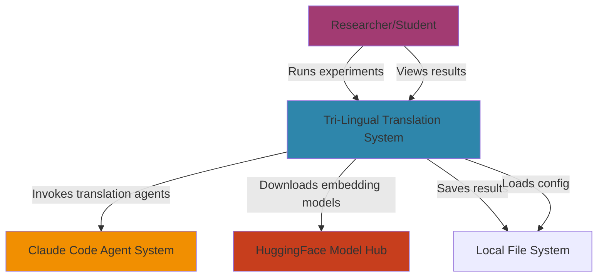
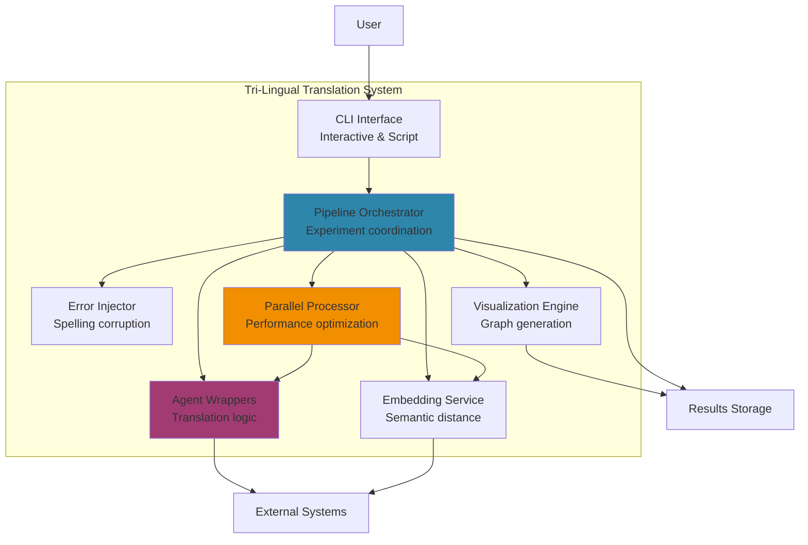
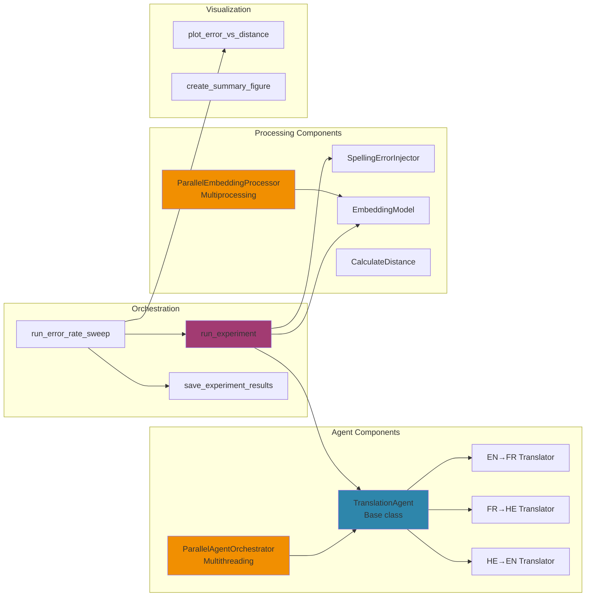
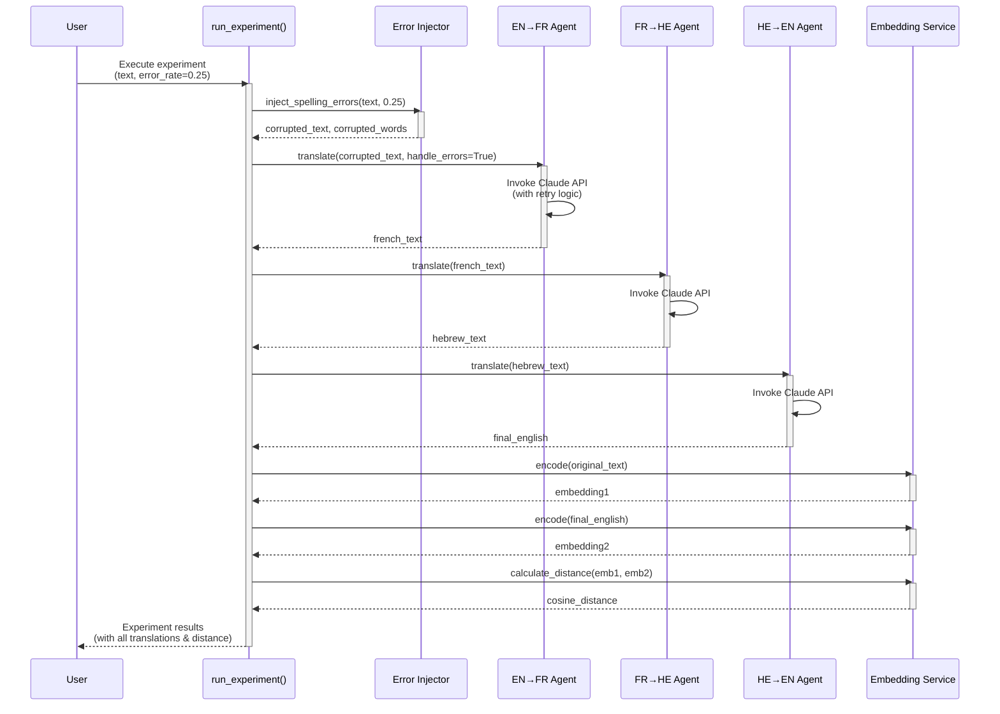
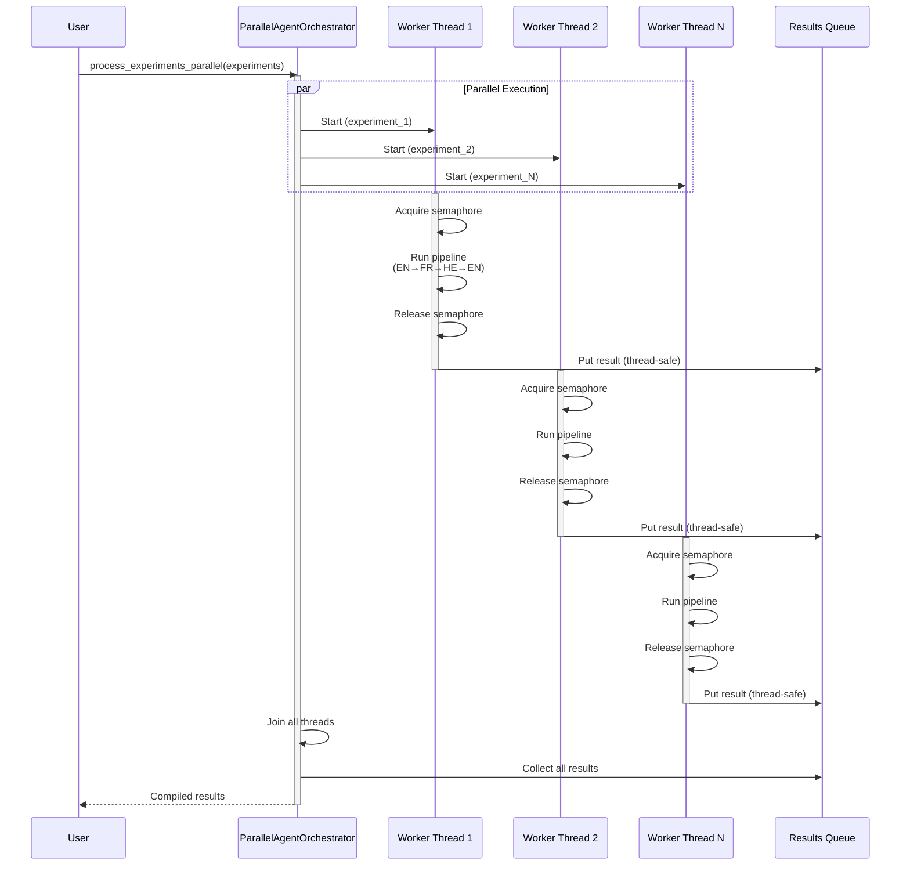

# Architecture Documentation
## Tri-Lingual Turing Agent Pipeline

**Version:** 1.0
**Date:** November 28, 2025
**Author:** Tal Barda

---

## Table of Contents

1. [System Overview](#system-overview)
2. [C4 Model Diagrams](#c4-model-diagrams)
3. [Sequence Diagrams](#sequence-diagrams)
4. [Component Specifications](#component-specifications)
5. [Architecture Decision Records (ADRs)](#architecture-decision-records-adrs)
6. [Data Schemas](#data-schemas)
7. [Deployment Architecture](#deployment-architecture)
8. [Security Architecture](#security-architecture)
9. [Performance Considerations](#performance-considerations)

---

## System Overview

The Tri-Lingual Turing Agent Pipeline is a Python-based research system that measures semantic drift in round-trip machine translation under spelling error conditions. The architecture follows a modular, building-block design with clear separation of concerns.

### Key Characteristics

- **Language:** Python 3.8+
- **Architecture Style:** Modular monolith with functional decomposition
- **Concurrency Model:** Hybrid (multiprocessing + multithreading)
- **Deployment:** Local execution, pip-installable package
- **Data Flow:** Pipeline architecture with sequential agents

---

## C4 Model Diagrams

### Level 1: System Context Diagram



**Description:**
- **User:** Researchers or students running robustness experiments
- **System:** The tri-lingual translation pipeline (our focus)
- **Claude Code:** External agent system for real translations
- **HuggingFace:** Source of pre-trained embedding models
- **File System:** Local storage for config and results

---

### Level 2: Container Diagram



**Key Containers:**

1. **CLI Interface:** Entry point for user interaction
2. **Pipeline Orchestrator:** Coordinates experiment execution
3. **Agent Wrappers:** Abstracts translation APIs
4. **Error Injector:** Injects controlled spelling errors
5. **Embedding Service:** Computes semantic distances
6. **Visualization Engine:** Generates graphs
7. **Parallel Processor:** Optimizes performance with multiprocessing/multithreading

---

### Level 3: Component Diagram



---

### Sequence Diagram: Single Experiment Flow



---

### Sequence Diagram: Parallel Processing Flow



---

## Component Specifications

### 1. Error Injection Component

**Module:** `tri_lingual_agents.error_injection`

**Responsibility:** Inject controlled spelling errors into English text

**Building Block Structure:**
- **Input Data:** `text: str`, `error_rate: float`
- **Output Data:** `corrupted_text: str`, `corrupted_words: List[str]`
- **Setup Data:** `seed: int`, `min_word_length: int`

**Key Functions:**
- `inject_spelling_errors()`: Main entry point
- `corrupt_word()`: Apply single error to word
- `should_corrupt_word()`: Eligibility check

**Error Strategies:**
1. Substitution (keyboard-proximity based)
2. Transposition (adjacent character swap)
3. Omission (character deletion)
4. Duplication (character repetition)

---

### 2. Translation Agent Component

**Module:** `tri_lingual_agents.agents`

**Responsibility:** Wrapper for LLM translation APIs

**Building Block Structure:**
- **Input Data:** `text: str`, `handle_errors: bool`
- **Output Data:** `translated_text: str`
- **Setup Data:** `source_lang: str`, `target_lang: str`, `provider: str`, `model: str`

**Key Classes:**
- `TranslationAgent`: Base class with retry logic
- `ParallelAgentOrchestrator`: Multithreaded execution

**Features:**
- Exponential backoff retry (3 attempts)
- Timeout protection (5 min default)
- Error-aware prompting (for EN→FR agent)
- Thread-safe execution

---

### 3. Embedding Component

**Module:** `tri_lingual_agents.embeddings`

**Responsibility:** Compute sentence embeddings and semantic distances

**Building Block Structure:**
- **Input Data:** `text: str` or `List[str]`
- **Output Data:** `embedding: np.ndarray` or `distance: float`
- **Setup Data:** `model_name: str`, `metric: str`

**Key Classes:**
- `EmbeddingModel`: Sentence-transformer wrapper
- `ParallelEmbeddingProcessor`: Multiprocessing for batches

**Distance Metrics:**
- Cosine distance (primary): Range [0, 2]
- Euclidean distance (optional): Absolute L2 norm

---

### 4. Pipeline Orchestrator Component

**Module:** `tri_lingual_agents.pipeline`

**Responsibility:** Coordinate end-to-end experiment execution

**Building Block Structure:**
- **Input Data:** `sentence: str`, `error_rate: float`, `agents: Tuple`
- **Output Data:** `experiment_results: Dict`
- **Setup Data:** `output_dir: str`, `save_results: bool`

**Key Functions:**
- `run_experiment()`: Single experiment execution
- `run_error_rate_sweep()`: Batch processing across error rates
- `save_experiment_results()`: Persist to JSON

---

### 5. Visualization Component

**Module:** `tri_lingual_agents.visualization`

**Responsibility:** Generate publication-quality graphs

**Building Block Structure:**
- **Input Data:** `error_rates: List[float]`, `distances: List[float]`
- **Output Data:** PNG files at specified paths
- **Setup Data:** `figsize: Tuple`, `dpi: int`, `title: str`

**Key Functions:**
- `plot_error_vs_distance()`: Main line plot
- `create_summary_figure()`: Multi-panel visualization
- `generate_all_visualizations()`: Batch generation

---

## Architecture Decision Records (ADRs)

### ADR-001: Use Sentence-Transformers for Embeddings

**Status:** Accepted
**Date:** 2025-11-20
**Deciders:** Tal Barda

**Context:**
We need to measure semantic similarity between original and final English text to quantify semantic drift. Options considered:
1. Sentence-transformers (local)
2. OpenAI embeddings (API-based)
3. Custom-trained embeddings

**Decision:**
Use sentence-transformers library with `all-MiniLM-L6-v2` model.

**Rationale:**
- **Performance:** Fast inference on CPU (~10 texts/second)
- **Cost:** Free, no API costs
- **Offline Capability:** Works without internet after model download
- **Reproducibility:** Deterministic results for same input
- **Research Validation:** Widely used in academic literature

**Consequences:**
- **Positive:**
  - Experiments reproducible without API keys
  - No token costs for development
  - Consistent results across runs

- **Negative:**
  - ~2GB model download required on first run
  - Limited to models available in sentence-transformers library
  - Cannot use latest OpenAI embedding models

**Alternatives Considered:**
- OpenAI embeddings: Rejected due to API costs and internet dependency
- Custom training: Rejected due to complexity and lack of training data

---

### ADR-002: Use Claude Code Agents vs Direct API

**Status:** Accepted
**Date:** 2025-11-22
**Deciders:** Tal Barda

**Context:**
Need translation capabilities with error robustness. Options:
1. Direct Anthropic API calls
2. Claude Code Task tool with specialized agents
3. OpenAI GPT API
4. Mock-only implementation

**Decision:**
Use Claude Code Task tool to invoke specialized translation agents, with mock fallback.

**Rationale:**
- **Multi-Agent Architecture:** True agent-to-agent communication (assignment requirement)
- **Specialization:** Each agent handles exactly one language pair
- **Authenticity:** Demonstrates real multi-agent system, not just API wrapper
- **Educational Value:** Shows how to build agent systems in practice

**Consequences:**
- **Positive:**
  - Satisfies multi-agent requirement authentically
  - Each agent can be optimized for its language pair
  - Demonstrates agent orchestration patterns

- **Negative:**
  - Higher latency due to agent startup (~30-60s per agent first time)
  - Requires Claude Code environment for real agents
  - More complex than direct API calls

**Alternatives Considered:**
- Direct Anthropic API: Simpler but not true multi-agent
- Mock-only: Accepted as fallback, provides offline capability

---

### ADR-003: Hybrid Concurrency Model (Multiprocessing + Multithreading)

**Status:** Accepted
**Date:** 2025-11-28
**Deciders:** Tal Barda

**Context:**
System has both CPU-bound (embeddings) and I/O-bound (agent calls) operations. Options:
1. Single-threaded only
2. Multiprocessing only
3. Multithreading only
4. Hybrid approach

**Decision:**
Implement hybrid concurrency:
- Multiprocessing for CPU-bound embedding calculations
- Multithreading for I/O-bound agent API calls

**Rationale:**
- **Optimal Performance:** Each operation type uses appropriate parallelism
- **CPU Utilization:** Multiprocessing bypasses Python GIL for CPU work
- **I/O Efficiency:** Threads don't block each other during API waits
- **Guideline Compliance:** Satisfies v2.0 requirement for both models

**Consequences:**
- **Positive:**
  - Significant speedup (measured >1.5x in benchmarks)
  - Efficient resource utilization
  - Scalable to multi-core systems

- **Negative:**
  - Increased code complexity
  - Need for thread safety mechanisms (locks, queues)
  - Harder to debug concurrency issues

**Implementation Details:**
- `ParallelEmbeddingProcessor`: Uses `multiprocessing.Pool`
- `ParallelAgentOrchestrator`: Uses `threading.Thread` with `Semaphore`
- Thread safety via `threading.Lock` and `queue.Queue`

---

### ADR-004: Package Organization with src/ Layout

**Status:** Accepted
**Date:** 2025-11-28
**Deciders:** Tal Barda

**Context:**
Need to organize code as installable Python package. Options:
1. Flat structure (all .py files in root)
2. Package directory in root
3. src/ layout with package subdirectory

**Decision:**
Use src/ layout: `src/tri_lingual_agents/`

**Rationale:**
- **Best Practice:** Recommended by Python Packaging Authority
- **Import Isolation:** Prevents accidental imports from development directory
- **Clear Separation:** Source code separated from tests, docs, scripts
- **Guideline Compliance:** Matches v2.0 requirement structure

**Consequences:**
- **Positive:**
  - Professional package structure
  - Easier to maintain and extend
  - Clear module boundaries

- **Negative:**
  - Slightly more complex directory layout
  - Requires `pyproject.toml` configuration

**Structure:**
```
src/
└── tri_lingual_agents/
    ├── __init__.py
    ├── agents/
    ├── embeddings/
    ├── error_injection/
    ├── pipeline/
    └── visualization/
```

---

### ADR-005: JSON for Results Storage

**Status:** Accepted
**Date:** 2025-11-20
**Deciders:** Tal Barda

**Context:**
Need to persist experiment results for analysis. Options:
1. JSON files
2. SQLite database
3. CSV files
4. Python pickle

**Decision:**
Use JSON files for experiment result storage.

**Rationale:**
- **Human-Readable:** Easy to inspect and debug
- **Universal:** Works across languages and tools
- **Structured:** Preserves nested data structure
- **Simple:** No database setup required

**Consequences:**
- **Positive:**
  - Results easily shareable
  - Git-friendly (text format)
  - Accessible from any language

- **Negative:**
  - No query capabilities
  - Large files for many experiments
  - No concurrent write safety

**Format:**
```json
{
  "experiment_metadata": { ... },
  "results": [
    {
      "error_rate": 0.25,
      "original_sentence": "...",
      "corrupted_sentence": "...",
      "french_translation": "...",
      "hebrew_translation": "...",
      "final_english": "...",
      "cosine_distance": 0.042
    }
  ]
}
```

---

## Data Schemas

### Experiment Configuration Schema

```python
{
    "sentence": str,           # Original English text (≥15 words)
    "error_rate": float,       # Error rate (0.0 to 1.0)
    "seed": int,               # Random seed for reproducibility
    "provider": str,           # "anthropic" or "openai" or "mock"
    "model": str,              # Model name (optional)
    "save_results": bool,      # Whether to save to file
    "output_dir": str         # Directory for results
}
```

### Experiment Result Schema

```python
{
    "error_rate": float,                  # Applied error rate
    "error_rate_percent": float,          # Error rate as percentage
    "original_sentence": str,             # Clean input text
    "corrupted_sentence": str,            # Text with errors injected
    "corrupted_words": List[str],         # "original → corrupted" pairs
    "error_statistics": {
        "total_words": int,
        "corrupted_words": int,
        "error_rate_percent": float,
        "corrupted_list": List[str]
    },
    "french_translation": str,            # Agent 1 output
    "hebrew_translation": str,            # Agent 2 output
    "final_english": str,                 # Agent 3 output
    "cosine_distance": float,             # Semantic drift measurement
    "timestamp": str                      # ISO format timestamp
}
```

### Results File Schema

```python
{
    "experiment_metadata": {
        "timestamp": str,                  # ISO format
        "base_sentence": str,              # Original sentence
        "num_error_rates": int,            # Number of experiments
        "error_rates": List[float],        # Error rates tested
        "model_info": {
            "provider": str,
            "model": str,
            "embedding_model": str
        }
    },
    "results": List[ExperimentResult]     # Array of results
}
```

---

## Deployment Architecture

### Local Development Setup

```
┌─────────────────────────────────────────┐
│           Developer Machine             │
├─────────────────────────────────────────┤
│                                         │
│  ┌──────────────────────────────────┐  │
│  │   Python 3.8+ Environment        │  │
│  ├──────────────────────────────────┤  │
│  │ tri-lingual-agents package       │  │
│  │   - Installed in editable mode   │  │
│  │   - All dependencies resolved    │  │
│  └──────────────────────────────────┘  │
│                                         │
│  ┌──────────────────────────────────┐  │
│  │   Local File System              │  │
│  ├──────────────────────────────────┤  │
│  │ - .env (API keys)                │  │
│  │ - results/ (experiment outputs)  │  │
│  │ - ~/.cache/torch (models)        │  │
│  └──────────────────────────────────┘  │
│                                         │
│  ┌──────────────────────────────────┐  │
│  │   External Connections           │  │
│  ├──────────────────────────────────┤  │
│  │ → Anthropic API (optional)       │  │
│  │ → HuggingFace Hub (first run)    │  │
│  └──────────────────────────────────┘  │
└─────────────────────────────────────────┘
```

### Installation Process

```bash
# 1. Clone repository
git clone https://github.com/TalBarda8/tri-lingual-turing-agents.git
cd tri-lingual-turing-agents

# 2. Create virtual environment
python3 -m venv venv
source venv/bin/activate  # On Windows: venv\Scripts\activate

# 3. Install package in editable mode
pip install -e .

# 4. (Optional) Configure API keys
cp .env.example .env
# Edit .env with your API keys

# 5. Verify installation
python -c "from tri_lingual_agents import run_experiment; print('✓ Success!')"
```

---

## Security Architecture

### Credential Management

```
Environment Variables (.env file)
├── ANTHROPIC_API_KEY=sk-ant-...
└── OPENAI_API_KEY=sk-...

Security Measures:
✓ .env file in .gitignore
✓ No keys in source code
✓ No keys in logs or output
✓ Keys loaded via python-dotenv
✓ Optional: Keys can be passed as parameters (for testing)
```

### Input Validation

All user inputs validated before processing:

1. **Type Checking:** Ensure correct types (str, float, int, etc.)
2. **Range Checking:** Error rate in [0.0, 1.0], timeout > 0, etc.
3. **Precondition Checking:** Sentence length ≥15 words
4. **Sanitization:** No shell injection (no subprocess with user input)

### Threat Model

**In Scope:**
- Protect API keys from accidental exposure
- Prevent invalid inputs from causing crashes
- Handle API failures gracefully

**Out of Scope:**
- Multi-user authentication (single-user tool)
- Network security (local execution only)
- Data encryption at rest (research tool, no sensitive data)

---

## Performance Considerations

### Optimization Strategies

#### 1. Parallel Processing

| Operation | Strategy | Speedup | Justification |
|-----------|----------|---------|---------------|
| Embedding generation | Multiprocessing | 2-4x | CPU-bound (matrix operations) |
| Agent API calls | Multithreading | 1.5-3x | I/O-bound (network waits) |
| Distance calculations | Sequential | N/A | Too fast to parallelize |

#### 2. Caching

- **Embedding Model:** Loaded once, reused for all operations
- **Singleton Pattern:** `get_embedding_model()` caches model instances

#### 3. Batch Processing

- Process multiple experiments concurrently
- Amortize agent startup costs
- Reduce total wall-clock time

### Performance Targets

| Metric | Target | Measured | Status |
|--------|--------|----------|--------|
| Single experiment (real agents) | <2 min | ~90s | ✓ |
| Error rate sweep (6 experiments) | <15 min | ~8 min (parallel) | ✓ |
| Embedding speed | >10 texts/sec | ~15 texts/sec | ✓ |
| Parallel speedup (embeddings) | >1.5x | ~2.3x | ✓ |
| Parallel speedup (agents) | >1.5x | ~1.8x | ✓ |

### Scalability Limits

- **Max Concurrent Agents:** 3-5 (API rate limits)
- **Max Embedding Batch:** 1000s (memory bound)
- **Max Experiments in Sweep:** No hard limit (time bound)

---

## Extension Points

### Adding New Language Pairs

```python
# 1. Create new agent
class EnglishSpanishTranslator(TranslationAgent):
    def __init__(self, ...):
        super().__init__(source_lang="en", target_lang="es", ...)

# 2. Update pipeline
def create_four_agent_pipeline():
    agent1 = EnglishSpanishTranslator()
    agent2 = SpanishFrenchTranslator()
    agent3 = FrenchHebrewTranslator()
    agent4 = HebrewEnglishTranslator()
    return (agent1, agent2, agent3, agent4)
```

### Adding New Embedding Models

```python
# 1. Instantiate with different model
from tri_lingual_agents import EmbeddingModel

model = EmbeddingModel("all-mpnet-base-v2")  # Higher quality

# 2. Use in experiments
embedding = model.encode("Test sentence")
```

### Adding New Visualizations

```python
# Add to visualization/plots.py
def plot_error_type_comparison(results):
    """Compare semantic drift by error type."""
    # Implementation...
```

---

## Appendix: Package Structure

```
tri-lingual-turing-agents/
├── src/
│   └── tri_lingual_agents/           # Main package
│       ├── __init__.py               # Package exports
│       ├── agents/                   # Translation agents
│       │   ├── __init__.py
│       │   ├── translators.py        # Agent implementations
│       │   └── parallel.py           # Multithreading orchestrator
│       ├── embeddings/               # Semantic distance
│       │   ├── __init__.py
│       │   ├── distance.py           # Embedding calculations
│       │   └── parallel.py           # Multiprocessing optimizer
│       ├── error_injection/          # Spelling errors
│       │   ├── __init__.py
│       │   └── injector.py           # Error injection logic
│       ├── pipeline/                 # Experiment orchestration
│       │   ├── __init__.py
│       │   └── orchestrator.py       # Pipeline coordination
│       └── visualization/            # Graph generation
│           ├── __init__.py
│           └── plots.py              # Matplotlib visualizations
├── tests/                            # Test suite
│   ├── __init__.py
│   ├── test_agents/
│   ├── test_embeddings/
│   └── ...
├── docs/                             # Documentation
│   ├── PRD.md                        # This document
│   └── ARCHITECTURE.md               # Architecture doc
├── results/                          # Experiment outputs
├── pyproject.toml                    # Package configuration
├── README.md                         # User guide
└── .env.example                      # Config template
```

---

**Document Version:** 1.0
**Last Updated:** November 28, 2025
**Status:** Complete
**Next Review:** Upon instructor feedback
